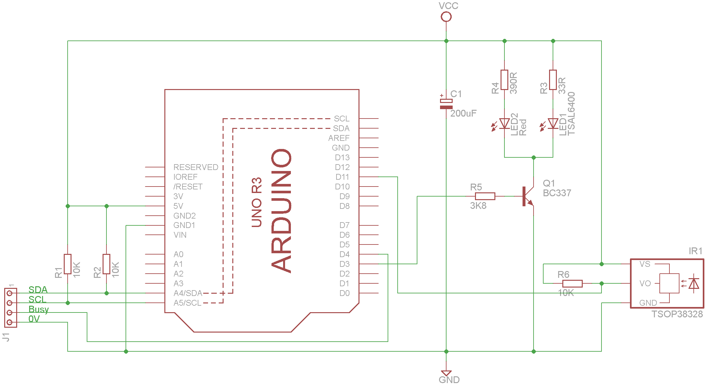
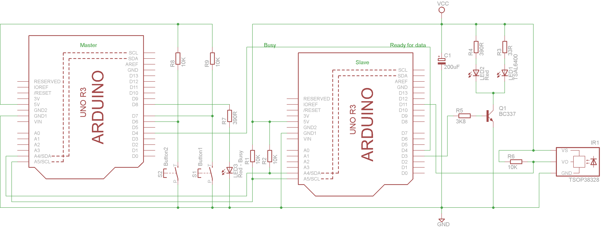

# I2C-IR-Remote-Controller-With-Arduino

I2C IR Remote Controller Using the Arduino Uno R3 or ATMega328P

### The I2C Remote Controller Hybrid

### Full circuit diagram

This repository holds details on how to create an I2C IR Remote Control Device. The hybrid circuit depicted above also allows for both IR remote control code transmission (TSAL6400) and IR remote device decoding (TSOP38328).

It requires the Arduino IRremote library by z3to available [here](https://github.com/z3t0/Arduino-IRremote/)

To read and decode a given IR remote control use the hybrid circuit above and program your Arduino Uno R3 with the example 'IRrecvDumpV2.ino' which comes with the IRremote library.

Open a serial monitor from your Arduino IDE (choose 9600 baud), key any button on your remote. The decoded output will appear in the serial monitor window.

### Test circuit diagram

To test your I2C remote set up the circuit shown below and programme the Master with 'IR_Remote_Sim_Test.ino' and the slave with 'IR_Remote_Sim.ino'
This example has been developed to control a Sky HD box and Sony BT Sound Bar, selecting channel BBC1 (Button 1) and muting the sound bar (Button 2) respectively.

By Steve Quinn

Written to support the following Instructable;

TBA